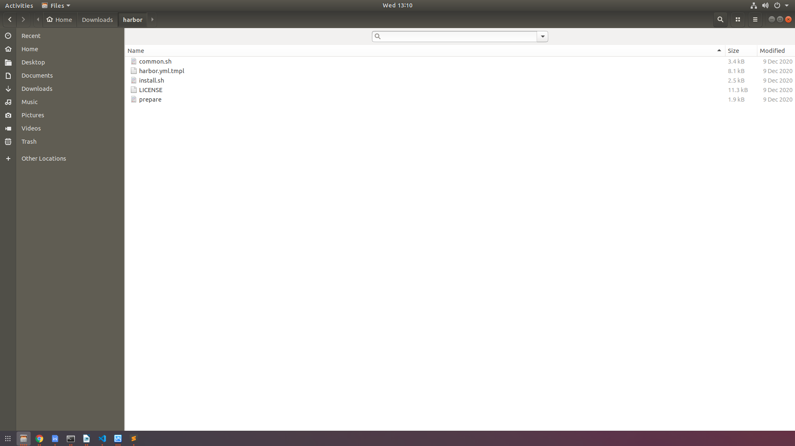
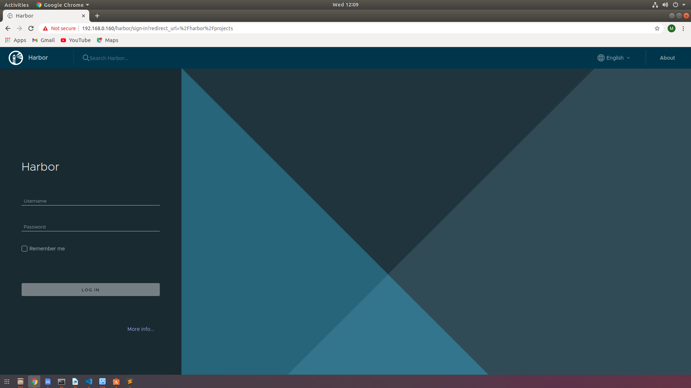
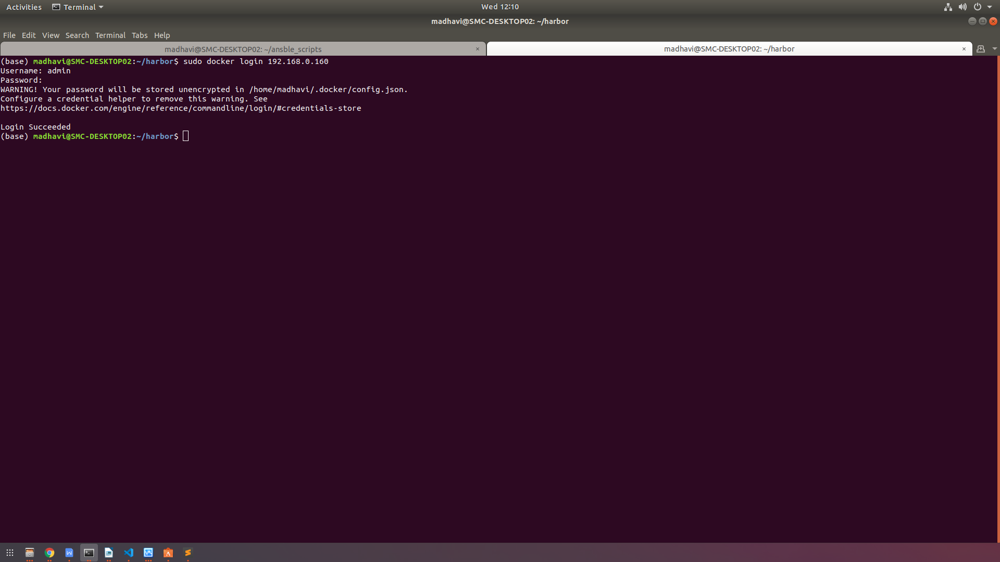

# Harbor Setup to work with HTTPS

## Download Harbor installer
1. Download the online latest and stable release of Harbor from https://github.com/goharbor/harbor/releases/
2. Extract the online installer file to your local machine to a e.g., ~/harbor. The file structure of the extracted harbor online installer appears as shown in the below image:



## SSL Certificate Generation
Run the following command to generate self seigned SSL certificate and key to access harbor with HTTPS access:
```sh
sudo openssl req -x509 -nodes -days 365 -newkey rsa:2048 -keyout /etc/ssl/private/harbor-selfsigned.key -out /etc/ssl/certs/harbor-selfsigned.crt
```
Copy the generated harbor-selfsigned.key and harbor-selfsigned.crt files to the following locations:

* To work with docker, copy to: /etc/docker/certs.d/harbor-selfsigned/
* To work with harbor, copy to the directory where harbor is extracted e.g., ~/harbor/data/certs

Note: Create the directories if they don't exists.


## Modify harbor.yml file
1. Edit the hostname to your domain_name or host IP address. 
E.g.,
```yml
hostname: 192.168.0.160
```
2. Modify the https section, so as to make harbor work with HTTPS.
    * Edit *port*, if HTTPS default port(443) is already in use
    * Set *certificate* to the path of generated ssl certificate  
    * Set *private_key* to the path of generated ssl private key
E.g.,
```yml
 https:
    port: 443
    certificate: /etc/ssl/certs/harbor-selfsigned.crt
    private_key: /etc/ssl/private/harbor-selfsigned.key>
```
3. Modify the internal_tls section, so as to make harbor work with TLS.
    * Set *enabled* to true, for enabling tls support to harbor
    * Set *dir* to the directory path to store the generated tls files
```yml
internal_tls:
    enabled: true
    dir: tls/certs
```
## TLS Certificate Generation:
1. Change to the directory where harbor is extracted say ~/harbor and run **prepare** script 
```sh
cd ~/harbor
./prepare
```
2. Ensure TLS certificates are generated to the directory path set in harbor.yml file.

## Run Installer script:
Now, run the installer.sh using below command:
```sh 
./install.sh
```
This script will install harbor and its other services using docker-compose. 

## Accessing Harbor:
**Ensure Harbor is accessing from web UI**

From browser, goto https://your-ip-address or https://your-domain-name 
E.g.,
https://192.168.0.160
 


**Ensure Harbor is accessing from docker**
Run the following command to access harbor private repository from docker:
```sh 
sudo docker login 192.168.0.160
```
Enter admin credentials which are defined in harbor.yml file. Ensure the login is successful.
 

# Forcing docker clients to trust the hosted harbor private repository:
1. Edit or Create /etc/docker/daemon.json with the following content on docker clients running on other machines to access harbor private repository.
/etc/docker/daemon.json
```json
{
  "insecure-registries" : ["https://192.168.0.160"]
}
```
2. Restart docker with the following command:
```sh
sudo systemctl restart docker
```
3. Now, try logging into harbor private registry from docker:
```sh
sudo docker login 192.168.0.160
```
Enter admin credentials which are defined in harbor.yml file. Ensure the login is successful.

To run the above procedure for forcing docker clients to trust the hosted harbor private repository as there can be no.of docker clients may be more in number. So one can try using Ansible playbooks for doing this at once for all docker clients.

## Using Ansible playbook for forcing all the docker clients to trust harbor private repository
1. Get the list of IP address of all the machines running docker client.
2. Copy the list of IP address in to /etc/docker/hosts
E.g.,
```yml
[all]
192.168.0.134
192.168.0.122
192.168.0.193
192.168.0.199    
192.168.0.194
192.168.0.192
192.168.0.133
192.168.0.198
192.168.0.126
```
3. Setup ssh connection between these machines and the ansible controller machine by following the instructions from here:
4. Run the ansible-playbook with the following command:
```sh
ansible-playbook copy_daemonjson_playbook.yml -K -e 'ansible_python_interpreter=/usr/bin/python3
```
5. The ansible-playbook consists of the following steps:
    * Copy daemon.json file to /etc/docker
    * Restarts docker to effect the changes made
    * installs python docker module to run docker commands from the ansible-playbook
    * Login to hosted harbor repository from docker
    * Logout from the hosted harbor repository from docker
